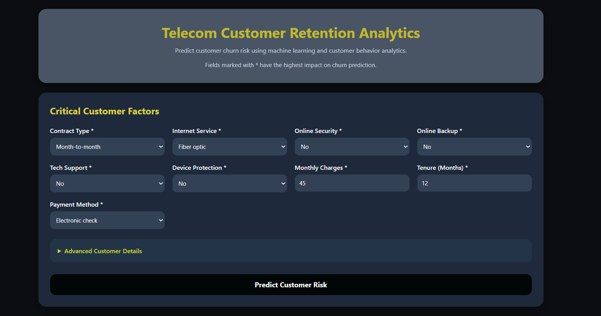

# Telecom Customer Retention Analytics

Predicting customer churn risk with machine learning, behavioral analytics, and an interactive retention dashboard.

[]()
[]()
[]()
[]()

---

## 🚀 Live Demo

🔗 https://huggingface.co/spaces/Nik0007/telecom_customer_retention_analytics

## Overview

Churn is one of the costliest problems for subscription businesses — every customer lost is also a customer who has to be replaced, and replacing is more expensive than retaining.

This project builds an end-to-end churn prediction pipeline for a telecom dataset: exploratory analysis to understand *why* customers leave, feature engineering and class-imbalance handling to train a reliable model, and a Flask web app that turns the model into something a non-technical user can actually act on.

**What it does:**
- Analyzes customer behavior and account data to surface churn drivers
- Trains and compares multiple classifiers, selecting the best-performing one
- Classifies any customer as Low / Medium / High churn risk in real time
- Serves predictions through a simple, responsive web dashboard

---

## Business Problem

Telecom providers often can't tell which customers are about to leave until they've already left. By the time a cancellation request comes in, retention offers are too late.

This project supports:
- **Early detection** of at-risk customers, before cancellation
- **Targeted retention efforts** instead of broad, costly campaigns
- **Lower revenue loss** from preventable churn
- **Data-backed decisions** instead of guesswork

---

## Tech Stack

| Layer | Tools |
|---|---|
| Data & ML | Python, Pandas, NumPy, Scikit-Learn, Imbalanced-Learn (SMOTEENN) |
| Modeling | Random Forest Classifier |
| Web App | Flask, HTML5, CSS3, JavaScript |

---

## Pipeline

```
Raw Customer Data
   → Exploratory Data Analysis
   → Feature Engineering
   → Class Imbalance Handling (SMOTEENN)
   → Model Training (Random Forest)
   → Model Evaluation
   → Flask Deployment
   → Retention Dashboard
```

---

## Key Churn Indicators

Ranked by feature importance from the trained model:

1. Contract type
2. Online security
3. Tech support
4. Customer tenure
5. Total charges
6. Online backup
7. Payment method
8. Internet service type

Customers on month-to-month contracts without security or tech-support add-ons, and with shorter tenure, show up as the highest-risk segment.

---

## Model Performance

Three algorithms were trained and compared. Class imbalance (churners are a minority class) was handled with SMOTEENN before final training.

| Model | Accuracy | Precision | Recall | F1-Score |
|---|---|---|---|---|
| Logistic Regression | _ 0.82_ | _ 0.70_ | _ 0.53_ | _ 0.61_ |
| Decision Tree | _ 0.80_ | _ 0.65_ | _ 0.53_ | _ 0.59_ |
| **Random Forest + SMOTEENN** | **_ 0.95_** | **_ 0.95_** | **_ 0.96_** | **_0.96_** |


**Why Random Forest + SMOTEENN was selected:**
- Strongest recall on the churn (minority) class — missing an at-risk customer is costlier than a false alarm
- Best F1-score across the candidates tested
- Stable performance across cross-validation folds

---

## Application Features

- Clean, modern analytics dashboard
- Single-customer churn prediction with real-time inference
- Three-tier risk classification: **Low / Medium / High**
- Automatic preprocessing of raw input (encoding, scaling)
- Responsive UI for desktop and mobile

---

## Project Structure

```
Customer_Churn_Project/
├── app.py                          # Flask application entry point
├── model.sav                       # Trained Random Forest model
├── tel_churn.csv                   # Processed dataset
├── requirements.txt
├── templates/
│   └── home.html
├── static/
│   ├── style.css
│   └── script.js
├── Churn Analysis - EDA.ipynb
├── Churn Analysis - Model Building.ipynb
└── README.md
```

---

## Installation & Usage

```bash
# Clone the repository
git clone <repository-url>
cd Customer_Churn_Project

# Install dependencies
pip install -r requirements.txt

# Run the app
python app.py
```

The dashboard will be available at `http://127.0.0.1:7860`.

---

## Dashboard Preview



---

## What I Learned

- Structuring an EDA to find *actionable* signals, not just interesting correlations
- Handling imbalanced classification with SMOTEENN rather than naive resampling
- Comparing models on recall/F1 rather than accuracy alone, given the class imbalance
- Packaging a trained model behind a Flask API for real-time inference
- Building a frontend that a non-technical stakeholder could actually use

---

## Roadmap

- [ ] SHAP-based explainability for individual predictions
- [ ] Customer segmentation for targeted retention offers
- [ ] Retention recommendation engine
- [ ] Streamlit alternative interface
- [ ] Cloud deployment (Render / AWS / Azure)
- [ ] Real-time data integration via streaming pipeline

---

## Author

**Nikhil Mishra**
B.Tech, Computer Science Engineering
Machine Learning · Data Science · Software Development
